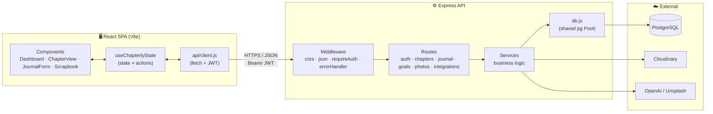
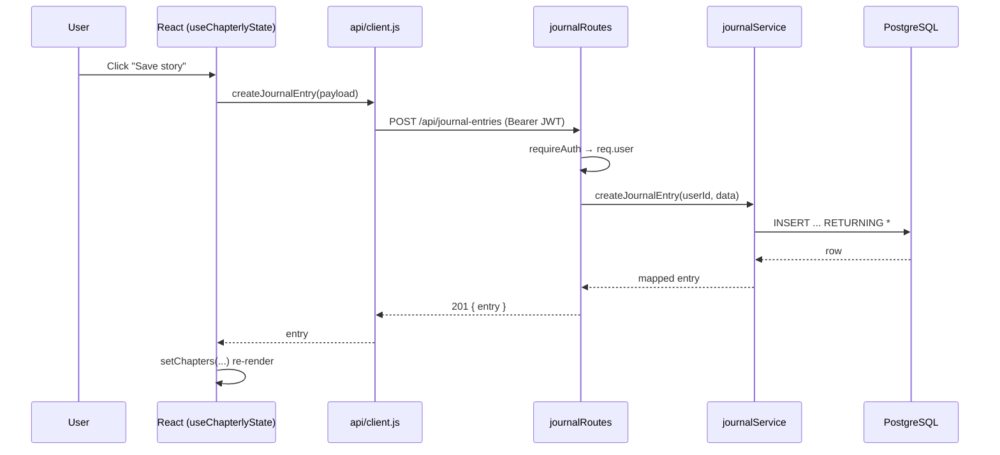
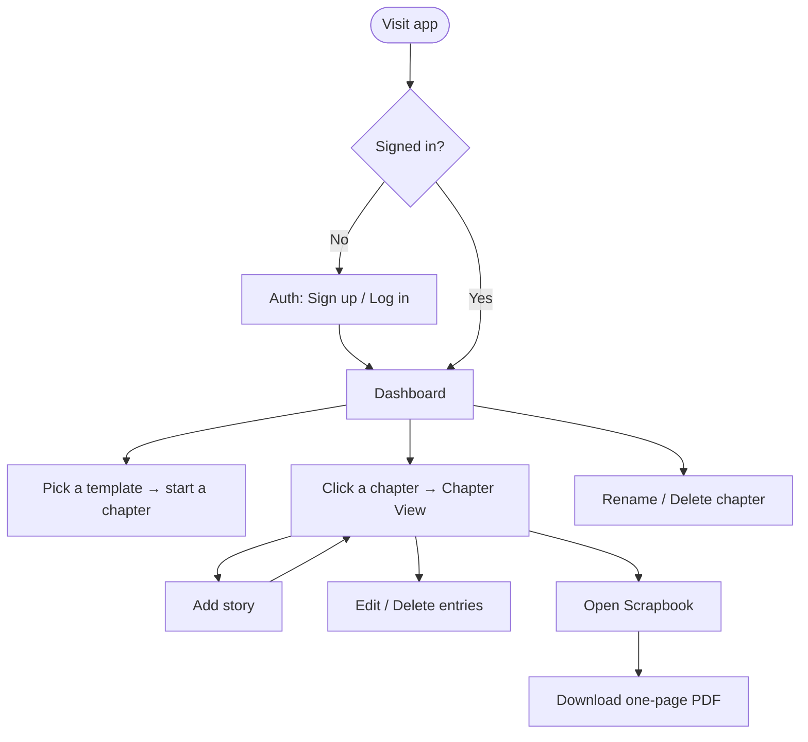

<div align="center">

# 📖 Chapterly

### A digital journal & scrapbook for the chapters of your life

*Document college, dating, a new job, a gap year, or any season worth remembering — one story, photo, and goal at a time.*


</div>

---

## ✨ Overview

Chapterly turns everyday moments into a keepsake. Each **life chapter** is its own private journal *and* scrapbook: you write dated stories with a mood and template-specific details, attach photos, track goals, and finally export a one-page PDF scrapbook to share.

The app is a classic **two-tier SPA**: a Vite + React client talks to an Express + PostgreSQL JSON API secured with JWT.

### Highlights

- 🔐 **Email/password auth** with hashed passwords and 7-day JWTs
- 🗂️ **Templated chapters** — College, Dating, Gap Year, New Job, Engagement, or a custom one — each with its own personalized prompts
- 📝 **Rich journal entries** — date, mood (emoji picker + dropdown), and per-template detail fields stored as flexible JSON
- 🖼️ **Cloudinary photo uploads** per chapter
- 🎯 **Goals** you can check off per chapter
- 📰 **Chapter view** to browse, inline-edit, and delete entries
- 📄 **PDF scrapbook export** fitted to a single page (jsPDF + html2canvas)
- 🤖 **Optional AI/stock-photo helpers** (OpenAI prompt/enhance, Unsplash search)

---

## 🧱 Tech Stack

| Layer | Technology |
|-------|-----------|
| **Frontend** | React 18, Vite 5, plain CSS (custom design system) |
| **Backend** | Node.js (20.11+), Express 4, ES Modules |
| **Database** | PostgreSQL via `pg` + `node-pg-migrate` |
| **Auth** | `jsonwebtoken`, `bcryptjs` |
| **Media** | Cloudinary (`multer` uploads), jsPDF + html2canvas (export) |
| **Integrations** | OpenAI, Unsplash (optional) |
| **Tests** | Node's built-in test runner (backend), Vitest + Testing Library (frontend) |

---

## 🗺️ Architecture

Chapterly uses a **layered backend** (routes → services → data access) behind a **single-page React client** that keeps all state in one custom hook.



### Request lifecycle (e.g. saving a story)



---

## 🧩 Design Patterns

Chapterly is intentionally small but applies several well-known patterns:

| Pattern | Where | Why |
|---------|-------|-----|
| **Layered / N-tier architecture** | `routes/` → `services/` → `db.js` | Keeps HTTP, business logic, and data access separate and testable |
| **Factory** | `createApp()` in `app.js` | Builds a fresh, configurable app for both the server and tests |
| **Singleton** | shared `pg.Pool` in `db.js` | One connection pool reused by every query |
| **Middleware chain (Chain of Responsibility)** | `cors → json → requireAuth → handler → errorHandler` | Composable cross-cutting concerns |
| **Decorator** | `asyncHandler()` wrapping route handlers | Forwards async errors to the central handler without try/catch noise |
| **Guard / Strategy** | `requireAuth` | Protects routes by verifying the JWT before the handler runs |
| **Centralized error handling** | `middleware/errorHandler.js` | Uniform JSON error responses |
| **Facade** | `api/client.js` & `useChapterlyState` | Hide `fetch`/token plumbing and expose simple actions to components |
| **Container / Presentational** | `App.jsx` (router/state) vs. view components | Separates orchestration from rendering |
| **Data-driven (template) configuration** | `constants/chapterTemplates.js` | Each chapter type declares its own prompt fields; forms render dynamically |
| **Adapter / mapper** | `mapEntry` / `mapChapter` / `normalizePhoto` | Translate DB rows ↔ UI-friendly shapes |

---

## 👤 User Flow



---

## 🗃️ Data Model

Four core tables — `users`, `chapters`, `stories` (journal entries), `goals`, and `photos` — all cascade-deleted from their owning chapter. Stories also carry an `entry_date` and a flexible `details` JSON column for template-specific prompts.

See the full ER diagram and API mapping in **[backend/docs/DATA_MODEL.md](backend/docs/DATA_MODEL.md)**.

```
users ──< chapters ──< stories
                   ├──< goals
                   └──< photos
```

---

## 📂 Repository Layout

```
practicum-final-project-front-row/
├── backend/
│   ├── migrations/              # node-pg-migrate SQL migrations
│   ├── docs/DATA_MODEL.md       # ER diagram + API mapping
│   └── src/
│       ├── app.js               # createApp() factory + route mounting
│       ├── index.js             # server entry point
│       ├── db.js                # shared PostgreSQL pool
│       ├── middleware/          # asyncHandler, requireAuth, errorHandler
│       ├── routes/              # HTTP layer (auth, chapters, journal, goals, photos, integrations)
│       └── services/            # business logic + SQL
├── frontend/
│   └── src/
│       ├── App.jsx              # view router + state wiring
│       ├── api/client.js        # fetch wrapper + JWT
│       ├── hooks/useChapterlyState.js   # central client state
│       ├── components/          # AuthForm, ChapterDashboard, ChapterView, JournalEntryForm, ScrapbookView
│       └── constants/           # chapterTemplates, moods
└── docker-compose.yml           # local PostgreSQL
```

---

## 🚀 Local Development

### 1. PostgreSQL (recommended)

From the repository root:

```bash
docker compose up -d
```

This starts a local `chapterly` database. (Alternatively use a local Postgres and `createdb chapterly`.)

### 2. Backend

```bash
cd backend
npm install
cp .env.example .env     # then fill in DATABASE_URL, JWT_SECRET, and optional keys
npm run migrate          # apply database migrations
npm run dev              # starts the API with --watch
```

> Node **20.11+** is required for `node-pg-migrate`. If `npm run migrate` fails with **database "chapterly" does not exist**, create it once (Docker Compose above does this automatically).

### 3. Frontend

```bash
cd frontend
npm install
npm run dev              # Vite dev server (proxies /api to the backend)
```

Open the printed local URL (default `http://localhost:5173`).

---

## 🔌 API Reference

All non-auth routes require `Authorization: Bearer <token>`.

| Method | Path | Auth | Purpose |
|--------|------|------|---------|
| `GET` | `/api/health` | No | Service heartbeat |
| `POST` | `/api/auth/register` | No | Create account, returns JWT |
| `POST` | `/api/auth/login` | No | Log in, returns JWT |
| `GET` | `/api/auth/me` | ✅ | Current user |
| `GET` / `POST` | `/api/chapters` | ✅ | List / create life chapters |
| `PUT` / `DELETE` | `/api/chapters/:id` | ✅ | Rename / delete a chapter (cascades) |
| `GET` / `POST` | `/api/journal-entries` | ✅ | List / create entries (with date, mood, details) |
| `GET` / `PUT` / `DELETE` | `/api/journal-entries/:id` | ✅ | Read / edit / delete an entry |
| `GET` / `POST` | `/api/goals` | ✅ | List / create goals |
| `PUT` / `DELETE` | `/api/goals/:id` | ✅ | Toggle/update / delete a goal |
| `GET` | `/api/photos` | ✅ | List photos (optionally by chapter) |
| `POST` | `/api/photos/upload` | ✅ | Upload a photo (multipart, Cloudinary) |
| `DELETE` | `/api/photos/:id` | ✅ | Delete a photo |
| `POST` | `/api/integrations/openai/prompt` | ✅ | Suggest a journal prompt |
| `POST` | `/api/integrations/openai/enhance` | ✅ | Polish journal text |
| `GET` | `/api/integrations/unsplash/search?query=` | ✅ | Search stock photos |

Copy `backend/.env.example` to `backend/.env` and add Cloudinary, OpenAI, and Unsplash keys when you use those features.

---

## 🧪 Tests

```bash
cd backend && npm test     # Node's built-in test runner
cd frontend && npm test    # Vitest + Testing Library
```

---

## 🛠️ Migrations

- **Apply:** `cd backend && npm run migrate`
- **Rollback last batch:** `npm run migrate:down`
- **New migration file:** `npm run migrate:create -- <name>` (timestamped file under `backend/migrations/`)

---

## 📅 Project Plan & Roadmap

Built incrementally across milestones:

- [x] **M1 — Foundations:** Express API scaffold, PostgreSQL schema & migrations, JWT auth
- [x] **M2 — Core journaling:** chapters, journal entries, goals, photo uploads (Cloudinary)
- [x] **M3 — Frontend integration:** React client wired to the API end-to-end
- [x] **M3.5 — Experience polish:**
  - [x] Share / copy-to-clipboard + PDF scrapbook export (single page)
  - [x] Edit & delete journal entries
  - [x] Dated entries + per-template personalized prompts
  - [x] Mood picker (emoji faces + dropdown) and full UI redesign
  - [x] "Story saved" toast, chapter rename, email validation
  - [x] Dedicated **Chapter View** with inline edit/delete; chapter **delete** (cascade)
- [ ] **Next up:**
  - [ ] Wire OpenAI prompt/enhance into the journal UI
  - [ ] Unsplash photo search in the photo picker
  - [ ] Multi-page / themed scrapbook layouts
  - [ ] Search & filter across chapters and moods
  - [ ] Automated end-to-end test coverage

---
## 👩‍💻 My Contributions

This project was developed as a team project. My contributions included:

- Connecting frontend functionality with backend API routes
- Contributing to project architecture and design documentation
- Supporting deployment configuration for the React frontend, Express API, and PostgreSQL database
- Contributing to project documentation and MVP deliverables

<div align="center">

*Made with care for documenting the chapters that matter. 📖*

</div>
